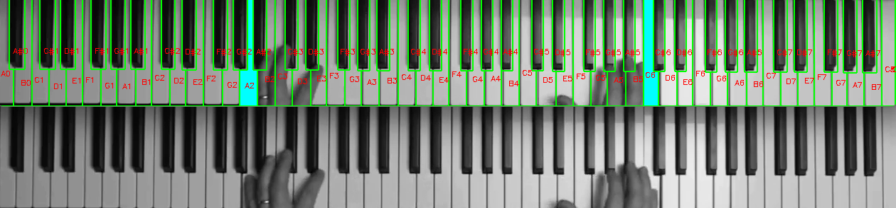

# Visual Automatic Music Transcription (VAMT)

[Demonstration](https://youtu.be/Oyk2DgLeJFQ)

Transcription of a piano piece based on [Akbaris work](https://ieeexplore.ieee.org/document/7225173), further extended with additional improvements, namely:
- Shadow handling through thresholding, avoiding preprocessing for shadow removal, and increasing stability.
- Removal of the continuous area assumption for pressed keys, addressing issues caused by hands and occlusion. Classification now relies on the ratio of delta pixels.

#### Future additions and improvements
- Adaptive threshold evaluation
- Use of a CNN for key press classification, replacing the ratio of delta pixels mentioned above
- output the detection to a midifile

### Usage
Create a virtual enviroment:
```
python -m venv [NAME]
```

Install dependencies
```
pip install -r requirements.txt
```

To transcribe a croped and rectified video use:
```
python ./KeyDetector.py --input [INPUTFILE]
```

#### Additional Arguments:
```
python ./KeyDetector.py --input <INPUTFILE> [--threshold_w <INT>] [--threshold_b <INT>] [--show_hist_metrics] [--hand_mask] [--difference_images]
```
- `--threshold_w`: Threshold for the average pixel value change of a white key to be considered as pressed
- `--threshold_b`: Threshold for the average pixel value change of a black key to be considered as pressed
- `--show_hist_metrics`: Displays a histogram of the average pixel change of a key after execution to optimize threshold_w and threshold_b
- `--hand_mask`: Displays the segmentation mask of the hands
- `--difference_images`: Displays the positive and negative difference images between frames and the background image
